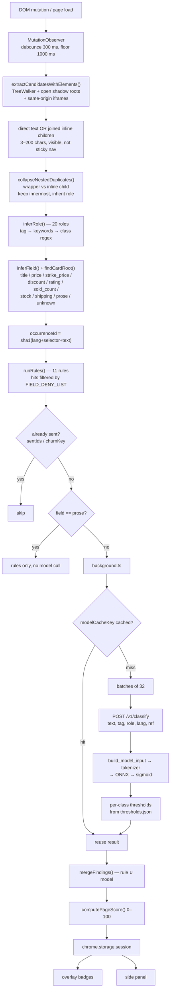

# Data flow — how a piece of page text becomes a label

End-to-end trace of one string, from the DOM node it was read out of to the badge
drawn over it. `ARCHITECTURE.md` describes the system's design and its API
contract; this file follows the *data*, in order, and names the module that owns
each step.

Current as of the field-inference change (2026-08-11).

---

## 0. The shape of the system

There is **no search, no retrieval, no index, and no database lookup** anywhere in
this pipeline. A candidate string is judged by two independent detectors that never
consult each other until the merge step:

| | Rule engine | Fine-tuned model |
|---|---|---|
| Runs | in the page, on the user's machine | backend, ONNX Runtime, CPU |
| Sees | text, its **field**, and the **live element** (computed CSS, checked state, animation cadence) | one string: `[TAG=…] [ROLE=…] text` |
| Method | 11 rules: unanchored regexes plus live DOM checks | 12-layer transformer, 8 sigmoid outputs |
| Cost | ~0 ms | ~24 ms per snippet (measured, fp32 CPU) |
| Fails by | matching wording that means something innocent | missing phrasings unlike its synthetic training data |
| Confidence emitted | `likely` | `possible` |

Neither can suppress the other. That is deliberate: the rules can see things a text
model cannot (a checkbox really is pre-checked, a decline link really is 40%
opacity), and the model can read phrasings no one wrote a regex for.

---

## 1. The pipeline

```
  ┌──────────────────────────── PAGE (content script, isolated world) ────────────────────────────┐
  │                                                                                                │
  │  DOM ─1─▶ extract ─2─▶ collapse ─3─▶ role ─4─▶ field ─5─▶ hash ─6─▶ rules ─▶ RuleHit[]          │
  │           candidates    nested       inference   inference   (2 kinds)   11 rules,             │
  │                         duplicates                                       field-gated           │
  └────────────────────────────────────────────────────────────────────────────┬───────────────────┘
                                                                                │ 7. sendMessage
  ┌───────────────────── SERVICE WORKER (background.ts) ───────────────────────┼───────────────────┐
  │   session cache ─8─▶ batch into 32 ─9─▶ POST /v1/classify ──────────────────┼─────────┐         │
  └────────────────────────────────────────────────────────────────────────────┘         │         │
                                                                                          │         │
  ┌───────────────────── BACKEND (FastAPI, :8000) ─────────────────────────────────────────▼───────┐
  │  10. build_model_input ─▶ 11. tokenize ─▶ 12. ONNX forward ─▶ 13. sigmoid ─▶ 14. thresholds     │
  │      "[TAG=..][ROLE=..]      WordPiece,      MuRIL fp32,          8 probs       per-class,      │
  │       text"                  ≤64 tokens      951 MB, CPU                        from JSON       │
  └────────────────────────────────────────────────────────────────────────────┬───────────────────┘
                                                                                │ 15. findings[]
  ┌────────────────────────────────────────────────────────────────────────────▼───────────────────┐
  │  16. merge (rule ∪ model) ─▶ 17. page score ─▶ 18. storage.session ─▶ 19. overlay + side panel  │
  └────────────────────────────────────────────────────────────────────────────────────────────────┘
```



### What crosses each boundary

| Boundary | Carries | Does **not** carry |
|---|---|---|
| page → content script | direct DOM read, same process | — |
| content script → service worker | full candidate (incl. `field`) + its rule hits | the live element |
| service worker → backend | **only** `text`, `tag`, `role`, `lang`, `ref` | `field`, selector, font size, contrast, checked, `is_animated`, page URL, rule hits |
| backend → service worker | findings (label, score, threshold), benign flag, all 8 scores on request | — |

The model never sees the structural signals, the field, or which rules fired. The
rules never see the model's scores. They meet only at step 16.

---

## 2. In the page

### Step 1 — Extraction (`lib/extract/extract.ts`)

A `TreeWalker` visits every element in the document, plus every **open shadow root**
and every **same-origin iframe** (cross-origin frames are unreachable by design).
Candidate text comes from one of two routes:

- **Direct text** — the element's own text nodes only, never its descendants'.
  This is what stops every ancestor from duplicating its children's text.
- **Leaf-block fallback** — an element with no direct text whose children are *all*
  inline tags has their text joined with spaces. Without it,
  `<div class="price"><s>Rs. 2,499</s><span>Rs. 1,199</span></div>` produced no
  candidate at all, and the price comparison — the thing worth judging — was lost.

Filters applied to every candidate:

| Filter | Value |
|---|---|
| length | 3–200 characters |
| not pure digits | `/^\d+$/` rejected |
| visible | not `display:none` / `visibility:hidden` / `opacity:0`; `fixed`/`sticky` counts as visible, because that is what cookie banners and modals are |
| not sticky page chrome | text pinned in a header/navbar is skipped — its viewport rect never changes, so a badge would sit welded to the corner |
| tag not skipped | `script`, `style`, `noscript`, `svg`, `head`, `template` |
| not `aria-hidden="true"` | subtree rejected |

Each survivor also records `font_px`, WCAG `contrast`, `checked`, and `is_animated`
(whether that selector's text has been observed changing on a regular cadence).

### Step 2 — Collapsing nested duplicates (`collapseNestedDuplicates`)

The two routes above **both fire on the same words** whenever a site wraps a single
inline node in a block. `<div class="sold"><span>958 sold</span></div>` yields the
string twice: once anchored to the `div` (leaf-block route), once to the `span`
(direct text). Both survive the extractor's own dedupe, because that is keyed by
`occurrenceId`, which folds in the selector — and the two selectors genuinely
differ.

Measured on a Daraz-shaped product card: **13 candidates for 8 distinct strings**,
five of them doubled. On the page that is two badges stacked on one string, and the
same content counted twice in the page score.

The **innermost** element is kept — the tightest box around the words being judged.
That also fixes a second symptom: `` is an inline tag, so a card link
`<a><span>title</span></a>` qualifies as a leaf block whose text is the title
but whose *element spans the image*; a badge anchored there outlined the whole
product image on click.

Two deliberate narrowings keep this a duplicate-collapse rather than a general
"prefer children" policy:

1. Only **identical** text collapses. The joined `Rs. 2,499 Rs. 1,199` is a string
   no child carries, so it and both children survive.
2. Only a wrapper with **no text of its own** is dropped. `<div>Hello<span>Hello</span></div>`
   renders the word twice, and both occurrences are real.

The wrapper's **role is inherited** by the element that is kept. Sites put the
meaningful class on the wrapper (`stock-info`, `pdp-discount`) and nothing on the
inline child, so the child alone infers the `body` fallback. Role is part of the
model input string — discarding it would silently change the question the model is
asked.

### Step 3 — Role inference (`lib/extract/role.ts`)

One of **20 roles** the model was trained on: `cta`, `decline`, `fine_print`,
`timer`, `stock`, `promo`, `badge`, `banner`, `modal_text`, `heading`, `checkbox`,
`form_gate`, `line_item`, `toast`, `help_text`, `label`, `nav`, `form`,
`support_link`, `body`. An ordered cascade: structural signals first
(`<input type=checkbox>`, `<h1>`), then per-language keyword lists, then CSS
class/id regexes, falling back to `body`. Keyword matching is **word-bounded** for
Latin scripts — `text.includes("cancel")` matched inside "Noise **Cancelling**", and
28 of 28 `role=decline` elements on one real Amazon page were headphone titles.
Devanagari keywords keep substring semantics, since JavaScript's `\b` is defined
against ASCII word characters and a bounded pattern would never match.

`role=timer` requires an explicit timer/countdown class **or** an observed ticking
cadence — a countdown ticks, a video's duration label does not, and the `MM:SS`
shape alone cannot tell them apart. Never an invented role — `assertRole`
runs on every call, because a role the model never saw fails silently.

Role is **baked into the model's input string**, so the same words with a different
role are a different question, a different cache entry, and potentially a different
answer.

### Step 4 — Field inference (`lib/extract/fields.ts`)

Which *part of a product listing* the text is: `title`, `price`, `strike_price`,
`discount`, `rating`, `sold_count`, `stock`, `shipping`, `prose`, or `unknown`.

Role answers a related question from the element in isolation, which is why a site
whose wrapper class is `offer-card` turns everything inside it into `promo`, and why
a rule handed `role=body` cannot tell a product title from a stock warning. A field
is inferred from **evidence about the text and its position in a product card**:

| Field | Evidence |
|---|---|
| `discount` | `-54%`, `54% off` — tested before price, since a percentage carries no currency |
| `strike_price` | currency inside `<s>`/`<del>`, or computed `text-decoration: line-through` |
| `price` | currency shape, not struck |
| `rating` | `4.6 out of 5`, `4.6/5`, `★` |
| `sold_count` | `958 sold`, `100+ sold` |
| `stock` | `only N left`, `N left in stock` |
| `shipping` | `free delivery`, `free shipping`, `delivery by` |
| `title` | a heading tag; or the longest still-unknown text inside the card's own `<a href>` |
| `prose` | 25+ words, or 2+ sentences with 8+ words, on a role that is neither interactive nor consequential UI copy — a review, a Q&A answer, a long description |

**Card detection** (`findCardRoot`) walks up until an ancestor has a sibling
rendered from the same template — a product grid is by construction a run of
near-identical subtrees, and that repetition is the one signal every storefront
shares regardless of its markup conventions. Twins are matched on tag plus mostly-
overlapping class tokens, not exact class equality, because storefronts append
per-item modifiers (`--sponsored`, `--sold-out`) to otherwise identical cards.

Two limits are load-bearing:

- **No site-specific selectors.** A `div.pdp-price` rule works on one storefront and
  silently does nothing on every other. Everything keys off structure (`<s>`,
  `<a href>`, heading tags, repeated siblings) and text shape.
- **`unknown` is a real answer.** On a product *detail* page nothing repeats, so
  `findCardRoot` returns null and only local evidence applies. Consumers must treat
  `unknown` as "no evidence", never as a reason to act.

`prose` earns its own step later: those candidates are **never sent to the model**.
The classifier was fine-tuned on interface copy (p95 34 tokens), a five-sentence
review is off-distribution, and `confirmshaming` carries the lowest threshold of the
eight classes (0.11) — measured across three real pages, 28 of 57 findings were
review or Q&A prose. Local rules still run on it: a structural gate inside a long
modal paragraph is still a gate.

`field` is **local to the extension**. It gates rules and appears in the debug
trace; it is not sent to the backend, whose model input format is frozen
(invariant #2).

### Step 5 — The two hashes (`lib/hash.ts`)

| Hash | Formula | Identifies | Used for |
|---|---|---|---|
| `occurrenceId` | `sha1(lang + selector + text)` | one **DOM node** | candidate id, element registry key, badge identity, the `ref` echoed by the backend |
| `modelCacheKey` | `sha1(lang + tag + role + text)` | one **question for the model** | the service worker's result cache |

Two "Add to Cart" buttons get two occurrence ids (so, two badges) but one model
cache key (so, one forward pass). The backend mirrors this split with `snippet_id`
and `cache_key`, the latter additionally folding in model version and threshold
profile — invariant #4.

### Step 6 — Rules (`lib/rules/`)

Eleven rules run locally, before and independently of any network call. Each returns
zero or more `{rule, label}` hits.

| Rule | Tests | Label |
|---|---|---|
| `stock_counter` | text: `only N left` (en/hi/ne), `lowest price`, `limited (time\|offer\|stock)`, `hurry` | `scarcity` |
| `countdown_timer` | `MM:SS` **and** observed animation cadence | `false_urgency` |
| `viewer_counter` | `N people are viewing/watching` | `social_proof` |
| `recent_activity` | purchase count bounded to a recent window ("in the last 24 hours") | `social_proof` |
| `discount_badge` | `role === "promo"` and `-N%` / `N% off` / `save N` | `false_urgency` |
| `prechecked_optin` | live DOM: marketing checkbox with `checked === true` | `sneaking` |
| `hidden_optout` | live CSS: decline control with small font / low contrast / low opacity | `obstruction` |
| `cta_asymmetry` | live CSS: accept far more prominent than decline | `obstruction` |
| `late_fee` | new charge appearing at `step === "payment"` | `sneaking` |
| `cancel_offsite` | cancel routes to `tel:` / `mailto:` / another origin | `obstruction` |
| `forced_action_gate` | required field or modal stating you must complete it | `forced_action` |

Matching is plain `RegExp.test()` on the candidate's text: case-insensitive,
**unanchored**, no tokenisation, no stemming, no fuzzy or semantic matching. A rule
fires or it does not.

**Field gating.** Hits from the four text-matching rules are dropped when the
candidate's field is one the rule is known to misfire on
(`FIELD_DENY_LIST` in `rules/index.ts`). `stock_counter` matching "Limited Stock" is
correct on a badge reading "Limited Stock — only 3 left" and wrong on "Hot Sale
Wireless Earbuds Limited Stock Offer", which is a seller's title copy; nothing in
the text distinguishes them, and the field does. Measured: that title was flagged
`scarcity` at the UI's strongest confidence while the classifier called the same
string benign at 0.896.

Rules that read **live DOM state** are never gated — they judge structure, and
structure means the same thing wherever it appears. A candidate whose field is
`unknown` is never blocked.

---

## 3. Across the wire

### Step 7–9 — Batching (`entrypoints/background.ts`)

- Candidates already sent this page are skipped (`sentIds`). A **churn key** —
  selector plus text with digit runs masked to `#` — stops a ticking counter from
  being re-sent once a second forever; the finding is the *pattern*, which does not
  change when the number does.
- Cache lookup by `modelCacheKey` in `chrome.storage.session`, which survives the
  MV3 service worker being killed.
- Misses are chunked into **batches of 32**, capped at **600 snippets per page**.
- 3 retries, exponential backoff from 250 ms. A batch failing after retries loses
  only its *model* findings; local rule hits still merge.
- Results are written to storage and pushed to the page **after every batch**, so
  badges appear progressively rather than after the whole page resolves — which
  matters at ~24 ms per snippet.

---

## 4. In the backend

### Step 10 — The model input string (`core/model_input.py`)

```python
f"[TAG={tag}] [ROLE={role}] {text}"
```

e.g. `[TAG=span] [ROLE=none] Only 2 left in stock!`

This must stay **byte-identical** to `ml/src/ml/config.py::build_model_input`
(invariant #2). A test guards it against the real `ml/` source. Divergence here is
feature skew: the model sees a differently-shaped string at serving time than in
training, every prediction degrades, and nothing fails.

Tags and roles are lowercased and trimmed at the request boundary — training never
saw `"P"` — so this function stays a pure mirror of training.

### Step 11 — Tokenization (`services/inference.py`)

The `tokenizers` fast tokenizer loaded straight from `tokenizer/tokenizer.json`;
`transformers` is deliberately not a serving dependency (~2.5 GB of torch for a
service that otherwise needs ~120 MB). WordPiece over MuRIL's ~197k vocabulary,
truncated at **64 tokens**, padded to the longest row in the batch rather than to
`max_length` — most UI microcopy is far shorter, and padding to 64 every time wastes
most of the compute.

### Step 12 — Forward pass

ONNX Runtime, CPU, fp32, 951 MB graph, **one session per process** (creating it per
request costs 200–500 ms). The model is `google/muril-base-cased` — a 12-layer
BERT-architecture transformer pre-trained on 17 Indian languages including Hindi and
Nepali — fine-tuned here on 28,450 synthetic rows (`synthetic_v2_1`) for multi-label
classification. Output: **8 raw logits per snippet**.

No lookup and no stored examples: each token attends to every other across 12
layers, the `[CLS]` position accumulates a 768-dimensional summary, and a final
linear layer projects it to 8 numbers. The training data lives in the weights.

At startup the engine refuses to serve a graph whose output axis disagrees with the
label contract, and runs a smoke check that must print `scarcity=0.626`.

### Step 13 — Sigmoid, not softmax (`services/postprocess.py`)

Each class gets an **independent** 0–1 probability. `"Only 3 left — sale ends in
10:00"` is both scarcity and false urgency, and 738 of 28,450 training rows carry
more than one label. Softmax would make the classes compete for one budget.

### Step 14 — Per-class thresholds

Loaded from `thresholds.json`, never a literal (invariant #3). Active profile
`precision`:

| class | threshold |
|---|---|
| confirmshaming | 0.11 |
| false_urgency | 0.58 |
| forced_action | 0.43 |
| obstruction | 0.54 |
| scarcity | 0.62 |
| sneaking | 0.48 |
| social_proof | 0.46 |
| benign | 0.17 |

A class becomes a finding **iff its probability ≥ its own threshold**. Flat 0.5
everywhere scores macro-F1 0.8280; this tuned vector scores 0.9019 on the same
split.

`benign` is the 8th output and is reported for transparency, but it is **not a
veto** — "benign" in a response means only that no dark class cleared its threshold.
Using it as one would double-count, since the model already trades it off against
the other seven.

The label order — `confirmshaming, false_urgency, forced_action, obstruction,
scarcity, sneaking, social_proof, benign` — is **frozen**, and is baked into the
ONNX output axis, `thresholds.json` and every cache key (invariant #1).

---

## 5. Back in the page

### Step 16 — Merge (`lib/merge.ts`)

| Situation | Confidence | `source` |
|---|---|---|
| rule fired **and** model cleared threshold | `likely` | `["model","rule"]` |
| rule fired only | `likely` | `["rule"]` |
| model cleared threshold only | `possible` | `["model"]` |

Neither side suppresses the other; both are reported with provenance, and the side
panel states in words which one produced a finding.

### Step 17 — Page score

`sum(2 per likely + 1 per possible)`, capped at 20, scaled to 0–100. Bands: <30 low,
<65 medium, ≥65 high. Published in `merge.ts` rather than hidden in a component —
an unexplained score is not defensible.

### Step 18–19 — Render

Badges live in a **closed shadow root** with `all: initial`, so host-page CSS cannot
break them and their styles cannot leak into the page. Each badge is
`position: fixed`, scored against six candidate positions around its target using
the target's *rendered text rectangles* (`Range.getClientRects()`), and collapses to
an icon when no clean slot exists. Clicking one pins a 2px outline around the
resolved element.

Prediction → live DOM resolution is `lib/resolve.ts`, a three-tier strategy that
**refuses to guess** on ambiguous or already-claimed matches: a badge withheld is
better than a badge on the wrong element.

---

## 6. Reading it back: the debug trace

Every candidate the page ever extracted gets one row, updated in place as its fate
becomes known. Popup → **"Download debug trace (JSON)"**, or `window.__dpExportTrace()`.

| Column | Answers |
|---|---|
| `text`, `tag`, `role`, `field` | what was extracted, and what it was taken to be |
| `ruleHits` | which local rules fired |
| `sentToModel` | whether it reached the backend at all |
| `findingLabels` | `null` = no response yet · `[]` = confirmed benign · non-empty = the labels |

`field` is usually the fastest column to read: it says whether a rule fired on a
badge or on a seller's title copy.

Two traps worth stating once. Reloading the extension does **not** replace a content
script already injected into an open tab — always open a fresh tab, or the zombie
reports "Extension context invalidated", which looks like a code bug and is not. And
a content script is injected once per *document*, not per navigation: on an SPA an
in-page route change replaces the DOM but leaves the script and all its state, which
is why every piece of per-page state here is scoped to a document URL.

---

## 7. What is measured, and what is not

| Claim | Status |
|---|---|
| 13 → 8 candidates on a Daraz-shaped card after collapsing duplicates | measured, unit fixture, 2026-08-11 |
| Product titles no longer produce rule hits on Daraz- and Amazon-shaped fixtures | measured, unit fixtures, 2026-08-11 |
| ~24 ms per snippet (382 ms for 16 uncached) | measured against the live backend, 2026-08-11 |
| 618 ms p50 per batch of 32 | `RESULTS.md` §5 |
| macro-F1 0.9019 synthetic, template-disjoint | `RESULTS.md` |
| macro-F1 0.394 model-only / 0.717 hybrid on real pages | `RESULTS.md` §6–7 — **silver set (LLM-labelled), preliminary** |
| Field inference on live storefronts | **not measured.** Verified only on unit fixtures; `strike_price` in particular depends on computed style, which jsdom does not evaluate |
| Nepali on real pages | **unevaluated** — 3 of 400 sampled rows |

Everything above describes **potentially manipulative patterns**. Nothing here is a
claim that any site is acting unlawfully.
